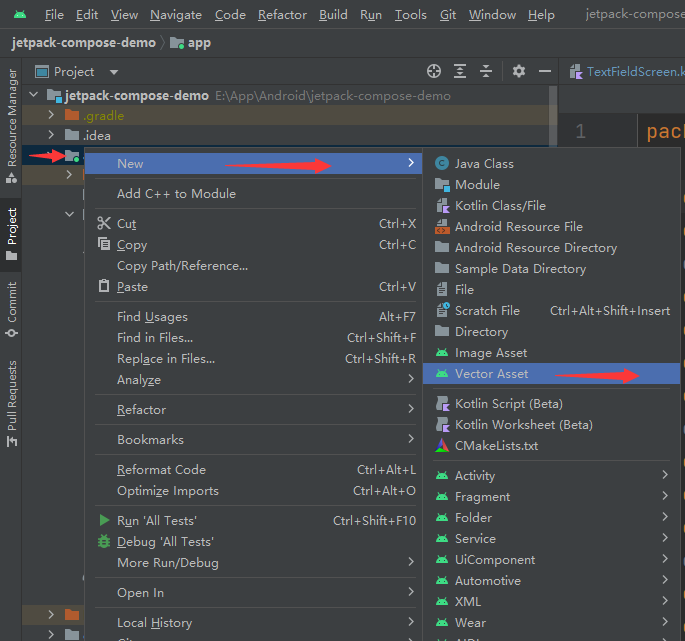
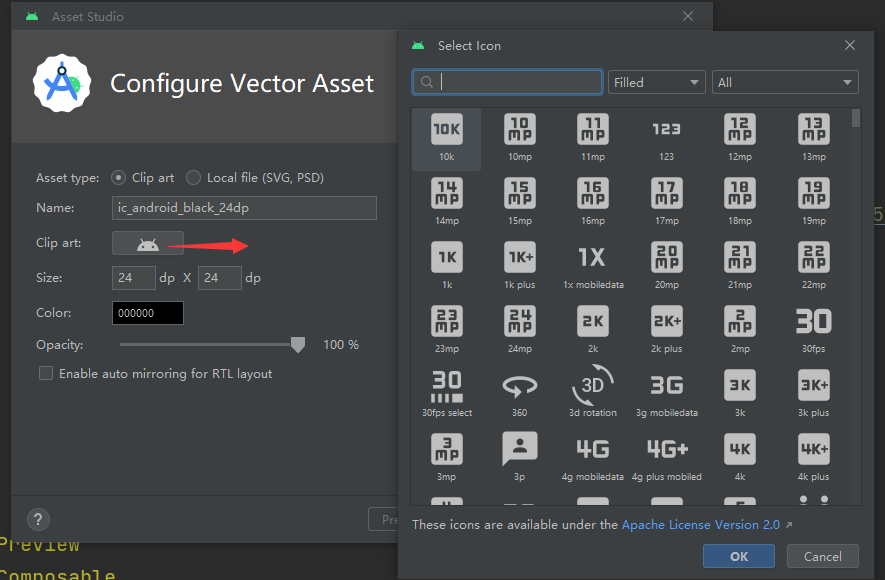
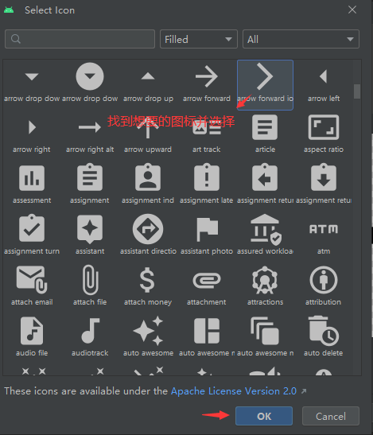
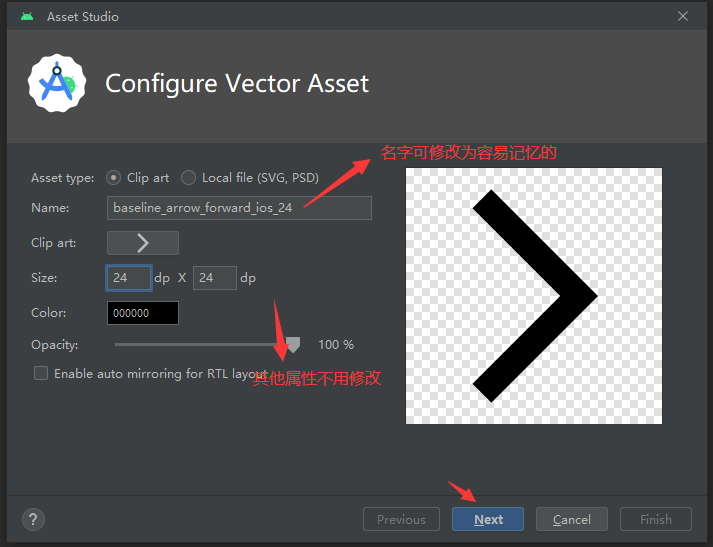
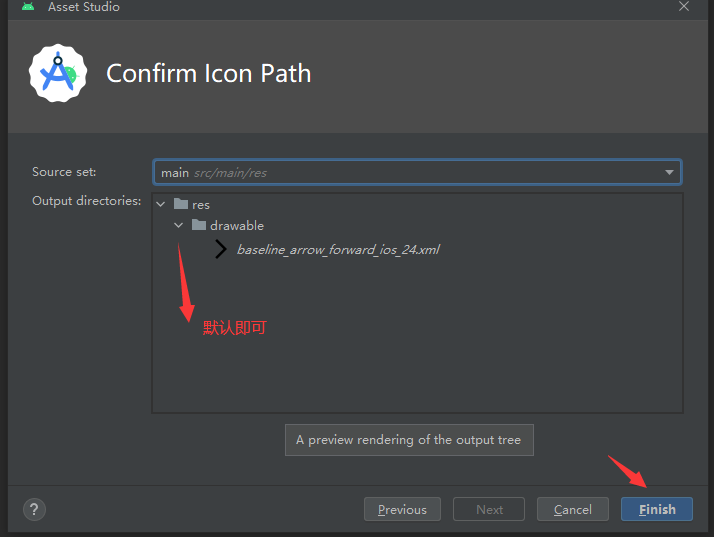

# Jetpack Compose 入门：Image 使用 Icon (vectorDrawables)

Jetpack Compose Image 显示矢量（vectorDrawables）图标（Icon）,分 `imageVector` 和 `painter` 两种方式。

使用系统提供的图标，首先是找到想要用的 Icon:





## imageVector

以 `imagevector` 的方式使用可参考  [Jetpack Compose 入门： Image](https://www.8ug.icu/articles/jetpack-compose-tutorial-image-lMn0Llj0zZ)。

对[Jetpack Compose 入门： Image](https://www.8ug.icu/articles/jetpack-compose-tutorial-image-lMn0Llj0zZ) 的一些补充说明：

 [Jetpack Compose](https://developer.android.google.cn/jetpack/androidx/releases/compose?hl=zh-cn) 库，要引入 Compose 的版本，指定 `compose-bom` 即可，然后确定使用 `material3` 还是 `material`, material-icons-extended 等的版本不需要特别指定，代码如下：

```kotlin
implementation platform('androidx.compose:compose-bom:2023.05.00')
implementation("androidx.compose.material3:material3" )
implementation("androidx.compose.material:material-icons-extended")
```

简单的示例代码：

```kotlin
Image(
	modifier = modifier.size(48.dp),
	imageVector = androidx.compose.material.icons.Icons.Default.Add,
)
```

## painter

用于绘制 `main/res/drawable` 目录下的图标，不仅可以使用官方提供的 Icon,还可以是其他想要使用的图标。

使用官方提供的 Icon，还需要做如下操作：







多少还是有些麻烦，使用官方提供的 Icon , 推荐以 `imageVector` 的方式。

如果是自己设计的图标，如果是矢量图，放在 `main/res/drawable` 目录下，如果是其他格式如png、webp 等，按分辨率设计多张分目录如 `main/res/drawable-xhdpi` 放置会更好。

示例代码：

```kotlin
 Image(painter = painterResource(id = R.drawable.baseline_add_24), contentDescription = "painterResource")
```


Demo; [https://github.com/hefengbao/jetpack-compose-demo.git ](https://github.com/hefengbao/jetpack-compose-demo.git )