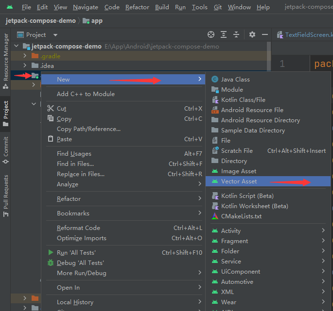

# Jetpack Compose 入门：Icon

之前的两篇文章 [Jetpack Compose 入门： Image](./jetpack-compose-tutorial-05-image) 、[Jetpack Compose 入门：Image 使用 Icon (vectorDrawables)](./jetpack-compose-tutorial-08-image-use-vectordrawables-imagevector-painter) 中写了使用 `Image` 组件显示图标，还有个 `Icon` 组件可以用来显示图标，示例代码：

```kotlin
@Composable
fun IconScreen(
    modifier: Modifier = Modifier
) {
    Column(
        modifier = modifier.fillMaxWidth()
    ) {
        Icon(
            painter = painterResource(id = R.drawable.ic_launcher_foreground),
            contentDescription = "",
            modifier = modifier.size(100.dp),
            tint = Color.Red
        )

        Icon(
            imageVector = Icons.Default.Home,
            contentDescription = "Home",
            modifier = modifier.align(Alignment.CenterHorizontally),
            tint = Color.Cyan
        )

        Icon(
            bitmap = ImageBitmap.imageResource(R.drawable.ic_avatar),
            contentDescription = "",
            modifier = modifier,
            tint = Color.Green
        )
    }
}
```

参数说明：

1、`painter`、`imageVector`、`bitmap` 用于指定要显示的图标，`painter` 和 `imageVector` 显示的是 ImageVector, 而 `bitmap` 显示的是 ImageBitmap，两者的区别请参考下方的文档及说明，尤其要注意的是 `painter` 、`bitmap` 显示的图标都在 `drawable` 目录下；

2、`contentDescription`：添加描述，可以为 `null`;

3、`modifier` ：添加 Modifier 属性；

4、`tint` ：修改 Icon 的颜色

参考文档： 

[ImageBitmap 与 ImageVector 对比](https://developer.android.google.cn/jetpack/compose/graphics/images/compare?hl=zh-cn)



从这里生成的 Icon（xml 文件） 一定是 ImageVector，而 `png`、`jpeg` 等文件则为 ImageBitmap。

Demo：[https://github.com/hefengbao/jetpack-compose-demo.git](https://github.com/hefengbao/jetpack-compose-demo.git)