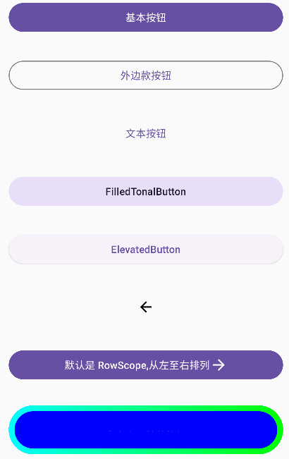

# Jetpack Compose 入门：Button、OutlinedButton、TextButton、IconButton、FilledTonalButton、ElevatedButton

按钮 `Button` 是 material3（`androidx.compose.material3.Button`）组件，常用的还有 `OutlinedButton`、`TextButton`、`IconButton`、`FilledTonalButton`、`ElevatedButton`。

```kotlin
@Composable
fun ButtonScreen(
    modifier: Modifier = Modifier
) {
    Column(
        modifier = modifier.fillMaxWidth()
    ) {
        Button(
            onClick = { /*TODO*/ },
            modifier = modifier
                .fillMaxWidth()
                .padding(16.dp),
        ) {
            Text(text = "基本按钮")
        }

        OutlinedButton(
            onClick = { /*TODO*/ },
            modifier = modifier
                .fillMaxWidth()
                .padding(16.dp),
        ) {
            Text(text = "外边款按钮")
        }

        TextButton(
            onClick = { /*TODO*/ },
            modifier = modifier
                .fillMaxWidth()
                .padding(16.dp),
        ) {
            Text(text = "文本按钮")
        }

        FilledTonalButton(
            onClick = { /*TODO*/ },
            modifier = modifier
                .fillMaxWidth()
                .padding(16.dp),
        ) {
            Text(text = "FilledTonalButton")
        }

        ElevatedButton(
            onClick = { /*TODO*/ },
            modifier = modifier
                .fillMaxWidth()
                .padding(16.dp),
        ) {
            Text(text = "ElevatedButton")
        }

        IconButton(
            onClick = { /*TODO*/ },
            modifier = modifier
                .fillMaxWidth()
                .padding(16.dp),
        ) {
            Icon(imageVector = Icons.Default.ArrowBack, contentDescription = "返回")
        }

        Button(
            onClick = { /*TODO*/ },
            modifier = modifier
                .fillMaxWidth()
                .padding(16.dp),
        ) {
            Text(text = "默认是 RowScope,从左至右排列")
            Icon(imageVector = Icons.Default.ArrowForward, contentDescription = "")
        }

        Button(
            onClick = { /*TODO*/ },
            modifier = modifier
                .fillMaxWidth()
                .padding(16.dp),
            enabled = true,
            shape = ButtonDefaults.elevatedShape,
            colors = ButtonDefaults.elevatedButtonColors(
                containerColor = Color.Blue,
                contentColor = Color.White,
                disabledContainerColor = Color.Blue.copy(alpha = 0.5f),
                disabledContentColor = Color.LightGray
            ),
            elevation = null,
            border = BorderStroke(8.dp, Brush.horizontalGradient(listOf(Color.Cyan, Color.Green))),
            contentPadding = PaddingValues(32.dp)
        ) {
            Text(text = "自定义属性的按钮")
        }
    }
}
```

基本属性：

```kotlin
@Composable
fun Button(
    onClick: () -> Unit,
    modifier: Modifier = Modifier,
    enabled: Boolean = true,
    interactionSource: MutableInteractionSource = remember { MutableInteractionSource() },
    elevation: ButtonElevation? = ButtonDefaults.elevation(),
    shape: Shape = MaterialTheme.shapes.small,
    border: BorderStroke? = null,
    colors: ButtonColors = ButtonDefaults.buttonColors(),
    contentPadding: PaddingValues = ButtonDefaults.ContentPadding,
    content: @Composable RowScope.() -> Unit
): Unit
```

参数:

`enabled` 是否启用或禁用；

`elevation` 高度；

`shape` 形状，`ButtonDefaults.outlinedShape`、`ButtonDefaults.textShape`、`ButtonDefaults.filledTonalShape`、`ButtonDefaults.elevatedShape`，其实提供了对应的组件： `OutlinedButton`、`TextButton`、`FilledTonalButton`；`ElevatedButton`

`border` 边框线；

`colors` 设置颜色，可以设置背景颜色、前景颜色、禁用状态和启动状态下的颜色；

`contentPadding`  内容内间距；

`content` 默认是 `RowScope.() ` 即 `Row`。



Demo: [https://github.com/hefengbao/jetpack-compose-demo.git](https://github.com/hefengbao/jetpack-compose-demo.git)