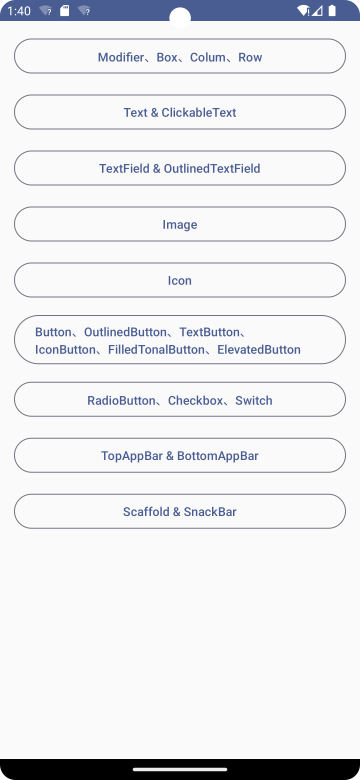

# Jetpack Compose 入门：Navigation 导航



使用 Naigation 导航把全前面的示例页面串联起来，如上图所示。

首先引入 navigation-compose , 在应用模块（当前项目是 app 目录下）的 build.gradle 文件中使用以下依赖项:

```
dependencies {
		......
		
    val nav_version = "2.5.3"
    implementation("androidx.navigation:navigation-compose:$nav_version")
}
```


可以如上图所示，建立 `route` 文件夹，用来管理导航逻辑，代码示例如下：

```kotlin
private const val ROUTE_HOME = "home"
private const val ROUTE_BASIC = "basic"
private const val ROUTE_TEXT= "text"
private const val ROUTE_TEXT_FIELD= "text_field"
private const val ROUTE_IMAGE= "image"
private const val ROUTE_ICON= "icon"
private const val ROUTE_BUTTON= "button"
private const val ROUTE_SELECTION= "selection"
private const val ROUTE_APPBAR= "appbar"
private const val ROUTE_SCAFFOLD= "scaffold"

@Composable
fun AppNavHost(
    navController: NavHostController
) {
    NavHost(
        navController = navController,
        startDestination = ROUTE_HOME
    ){
        composable(route = ROUTE_HOME){
            HomeScreen(
                onBasicClick = { navController.navigate(ROUTE_BASIC) },
                onTextClick = { navController.navigate(ROUTE_TEXT) },
                onTextFieldClick = { navController.navigate(ROUTE_TEXT_FIELD)},
                onImageClick = { navController.navigate(ROUTE_IMAGE) },
                onIconClick = { navController.navigate(ROUTE_ICON) },
                onButtonClick = { navController.navigate(ROUTE_BUTTON) },
                onSelectionClick = { navController.navigate(ROUTE_SELECTION) },
                onAppBarClick = { navController.navigate(ROUTE_APPBAR) },
                onScaffoldClick = { navController.navigate(ROUTE_SCAFFOLD)}
            )
        }

        composable(route = ROUTE_BASIC){
            BasicScreen()
        }

       // 省略若干代码

        composable(ROUTE_SCAFFOLD){
            ScaffoldScreen(
                onBackClick = navController::navigateUp
            )
        }
    }
}
```

编辑 `MainActivity.kt`：

```kotlin
class MainActivity : ComponentActivity() {
    override fun onCreate(savedInstanceState: Bundle?) {
        super.onCreate(savedInstanceState)
        setContent {
            val navController = rememberNavController()
            JetpackcomposedemoTheme {
               AppNavHost(navController)
            }
        }
    }
}
```

`  val navController = rememberNavController()` 获取 NavHostControoler 。

`navController.navigate()` 导航到具体的页面

` navController::navigateUp` 、 `navController.navigateUp()` 返回上一个页面。


参考文档 [使用 Compose 进行导航](https://developer.android.google.cn/jetpack/compose/navigation?hl=zh-cn)

Demo：[https://github.com/hefengbao/jetpack-compose-demo](https://github.com/hefengbao/jetpack-compose-demo) 