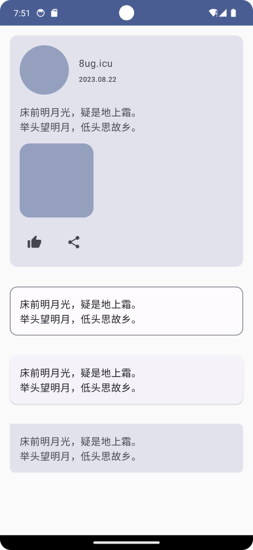

# Jetpack Compose 入门：Card



`Card`、`OutlinedCard`、`ElevatedCard` 是 material3 组件，可以通过设置 `shape = RoundedCornerShape()` 完成聊天气泡效果的 Card。

```kotlin
@Composable
fun CardScreen(
    modifier: Modifier = Modifier
) {
    val text = """
        床前明月光，疑是地上霜。
        举头望明月，低头思故乡。
    """.trimIndent()

    Column(
        modifier = modifier.fillMaxWidth()
    ) {
        Card(
            modifier = modifier
                .fillMaxWidth()
                .padding(16.dp)
        ) {
            Column(
                modifier = modifier
                    .fillMaxWidth()
                    .padding(16.dp),
                verticalArrangement = Arrangement.spacedBy(16.dp)
            ) {
                Row(
                    verticalAlignment = Alignment.CenterVertically,
                    horizontalArrangement = Arrangement.spacedBy(16.dp)
                ) {
                    AsyncImage(
                        model = "https://unsplash.com/photos/ZaU21K_4ZpA",
                        contentDescription = null,
                        modifier = modifier
                            .size(80.dp)
                            .clip(CircleShape)
                            .background(MaterialTheme.colorScheme.primary.copy(alpha = 0.5f)),
                        contentScale = ContentScale.Crop,
                    )

                    Column(
                        modifier = modifier
                            .fillMaxWidth()
                            .weight(1f),
                        verticalArrangement = Arrangement.spacedBy(8.dp)
                    ) {
                        Text(text = "8ug.icu")
                        Text(text = "2023.08.22", style = MaterialTheme.typography.labelSmall)
                    }
                }

                Text(text = text)

                AsyncImage(
                    model = "https://unsplash.com/photos/a-white-and-brown-dog-walking-across-a-lush-green-field-TDOM2os-JYs",
                    contentDescription = null,
                    modifier = modifier
                        .size(120.dp)
                        .clip(RoundedCornerShape(16.dp))
                        .background(MaterialTheme.colorScheme.primary.copy(alpha = 0.5f)),
                    contentScale = ContentScale.Inside
                )

                Row(
                    horizontalArrangement = Arrangement.spacedBy(16.dp)
                ) {
                    IconButton(onClick = { /*TODO*/ }) {
                        Icon(imageVector = Icons.Default.ThumbUp, contentDescription = null)
                    }
                    IconButton(onClick = { /*TODO*/ }) {
                        Icon(imageVector = Icons.Default.Share, contentDescription = null)
                    }
                }
            }
        }

        OutlinedCard(
            modifier = modifier
                .fillMaxWidth()
                .padding(16.dp),
        ) {
            Text(
                text = text,
                modifier = modifier
                    .fillMaxWidth()
                    .padding(16.dp)
            )
        }

        ElevatedCard(
            modifier = modifier
                .fillMaxWidth()
                .padding(16.dp),
        ) {
            Text(
                text = text,
                modifier = modifier
                    .fillMaxWidth()
                    .padding(16.dp)
            )
        }

        Card(
            modifier = modifier
                .fillMaxWidth()
                .padding(16.dp),
            shape = RoundedCornerShape(
                topStart = 0.dp,
                topEnd = 8.dp,
                bottomStart = 8.dp,
                bottomEnd = 8.dp
            )
        ) {
            Text(
                text = text,
                modifier = modifier
                    .fillMaxWidth()
                    .padding(16.dp)
            )
        }
    }
}
```

Demo：[https://github.com/hefengbao/jetpack-compose-demo](https://github.com/hefengbao/jetpack-compose-demo) 