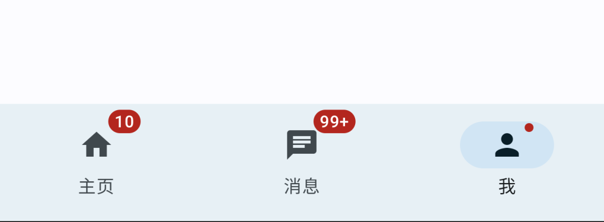

# Jetpack Compose 入门：NavigationBar & Badge



NavigationBar 实现底部导航栏，一般建议放置 3~ 5 个菜单，通过 BadgedBox（Badge） 显示消息数目（提示）。


```kotlin
@OptIn(ExperimentalMaterial3Api::class)
@Composable
fun NavigationBarScreen(
    modifier: Modifier = Modifier
) {
    val list = listOf(
        NavigationItem(icon = Icons.Default.Home, label = "主页", hasNew = false, count = 10),
        NavigationItem(icon = Icons.Default.Chat, label = "消息", hasNew = false, count = 100),
        NavigationItem(icon = Icons.Default.Person, label = "我", hasNew = true, count = null),
    )

    var selectedItem by remember { mutableStateOf(0) }

    Scaffold(
        topBar = {},
        bottomBar = {
            NavigationBar {
                list.forEachIndexed { index, navigationItem ->
                    NavigationBarItem(
                        selected = selectedItem == index,
                        onClick = { selectedItem = index },
                        icon = {
                            if (navigationItem.hasNew || navigationItem.count != null) {
                                BadgedBox(
                                    badge = {
                                        if (navigationItem.count != null) {
                                            Badge {
                                                Text(
                                                    text = if (navigationItem.count >= 100){
                                                        "99+"
                                                    }else{
                                                        navigationItem.count.toString()
                                                    }
                                                )
                                            }
                                        } else {
                                            Badge()
                                        }
                                    }
                                ) {
                                    Icon(imageVector = navigationItem.icon, contentDescription = null)
                                }
                            }

                        },
                        label = {
                            Text(text = navigationItem.label)
                        }
                    )
                }
            }
        }
    ) {paddingValues ->
        Box(
            modifier = modifier
                .padding(paddingValues)
                .fillMaxSize(),
            contentAlignment = Alignment.Center
        ){
            Text(text = list[selectedItem].label)
        }
    }
}

data class NavigationItem(
    val icon: ImageVector,
    val label: String,
    val hasNew: Boolean = false,
    val count: Int? = null
)
```

Demo：[https://github.com/hefengbao/jetpack-compose-demo](https://github.com/hefengbao/jetpack-compose-demo)