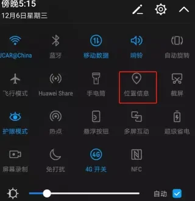

# Jetpack Compose 入门：权限请求

使用谷歌官方库 [Accompanist](https://github.com/google/accompanist) 来请求权限，文档 [https://google.github.io/accompanist/permissions/](https://google.github.io/accompanist/permissions/) 。

示例代码请求定位权限，因为要正常使用定位功能，不仅需要用户授予权限，还要用户打开【位置信息】（如下图），通过代码来判断是否已开启，如果没有开启，则提示用户去设置：



在 `AndroidManifest.xml` 声明所需的权限：

```xml
<uses-permission android:name="android.permission.ACCESS_FINE_LOCATION" />
<uses-permission android:name="android.permission.ACCESS_COARSE_LOCATION" />
```

```kotlin
@OptIn(ExperimentalPermissionsApi::class)
@Composable
fun PermissionScreen(
    modifier: Modifier = Modifier
) {
    var permissionRequested = false

    val permissionState = rememberPermissionState(
        android.Manifest.permission.ACCESS_FINE_LOCATION
    ){
        Log.i("Permission","State = $it")
        permissionRequested = true
    }

    val context = LocalContext.current

    var shouldOpenLocationSettings by remember { mutableStateOf(false) }

    var shouldShowRationale by remember { mutableStateOf(false) }

    var shouldShowAppSettings by remember { mutableStateOf(false) }

    Button(
        onClick = {
            if (locationServiceEnabled(context)){
                if (permissionState.status.isGranted){
                    // 定位逻辑
                    Log.i("Permission","定位逻辑")
                }else{
                    if (permissionState.status.shouldShowRationale){
                        Log.i("Permission", "shouldShowRationale")
                        shouldShowRationale = true
                    }else{
                        Log.i("Permission","第一次请求亦或者是第三次请求？")
                        if (!permissionRequested){
                            permissionState.launchPermissionRequest()
                        }else{
                            Log.i("Permission","去设置")
                            shouldShowAppSettings = true
                        }
                    }
                }
            }else{
                // 没有开启 【位置信息】，则提示去设置
                shouldOpenLocationSettings = true
            }
        }
    ) {
        Icon(imageVector = Icons.Default.LocationOn, contentDescription = null)
        Text(text = "获取位置")
    }

    if (shouldOpenLocationSettings){
        AlertDialog(
            onDismissRequest = { shouldOpenLocationSettings = false },
            confirmButton = {
                Button(
                    onClick = {
                        try {
                            context.startActivity(
                                Intent(Settings.ACTION_LOCATION_SOURCE_SETTINGS)
                            )
                        }catch (e: Exception){
                            context.startActivity(
                                Intent(Settings.ACTION_SETTINGS)
                            )
                        }
                    }
                ) {
                    Text(text = "设置")
                }
            },
            dismissButton = {
                TextButton(onClick = { shouldOpenLocationSettings = false }) {
                    Text(text = "取消")
                }
            },
            text = {
                Text(text = "您的系统设置没有开启【位置信息】，请前往设置界面开启")
            }
        )
    }

    if (shouldShowAppSettings){
        AlertDialog(
            onDismissRequest = { shouldShowAppSettings = false },
            confirmButton = {
                Button(
                    onClick = {
                        context.startActivity(
                            Intent(Settings.ACTION_APPLICATION_DETAILS_SETTINGS).apply {
                                data = Uri.fromParts("package", context.packageName, null)
                            }
                        )
                        shouldShowAppSettings = false
                    }
                ) {
                    Text(text = "去设置")
                }
            },
            dismissButton = {
                TextButton(onClick = { shouldShowAppSettings = false }) {
                    Text(text = "取消")
                }
            },
            text = {
                Text(text = "您已拒绝授予定位权限，请前往设置界面授权")
            }
        )
    }

    if (shouldShowRationale){
        AlertDialog(
            onDismissRequest = { shouldShowRationale = false },
            confirmButton = {
                Button(
                    onClick = {
                        shouldShowRationale = false
                        permissionState.launchPermissionRequest()
                    }
                ) {
                    Text(text = "授权")
                }
            },
            dismissButton = {
                TextButton(onClick = { shouldShowRationale = false }) {
                    Text(text = "取消")
                }
            },
            text = {
                Text(text = "定位需要您授予权限才嗯能使用")
            }
        )
    }
}

private fun locationServiceEnabled(context: Context): Boolean = when{
    Build.VERSION.SDK_INT >= Build.VERSION_CODES.P -> {
        val locationManager = context.getSystemService(Context.LOCATION_SERVICE) as LocationManager
        locationManager.isLocationEnabled
    }
    else -> {
        try {
            Settings.Secure.getInt(
                context.contentResolver, Settings.Secure.LOCATION_MODE
            ) != Settings.Secure.LOCATION_MODE_OFF
        }catch (e: Settings.SettingNotFoundException){
            false
        }
    }
}
```

>Limitations
This permissions wrapper is built on top of the available Android platform APIs. We cannot extend the platform's capabilities. For example, it's not possible to differentiate between the it's the first time requesting the permission vs the user doesn't want to be asked again use cases.

如文档所说，这个方案不是完美解决方案，在用户选择了“拒绝且不在提醒” 时，需要做特别处理。我使用 `permissionRequested` 做了一个简单的判断，但是在关闭应用后再次打开，需要点击两次才能出发正常的逻辑。

参考文档：

[请求运行时权限](https://developer.android.google.cn/training/permissions/requesting?hl=zh-cn)

Demo：[https://github.com/hefengbao/jetpack-compose-demo](https://github.com/hefengbao/jetpack-compose-demo) 