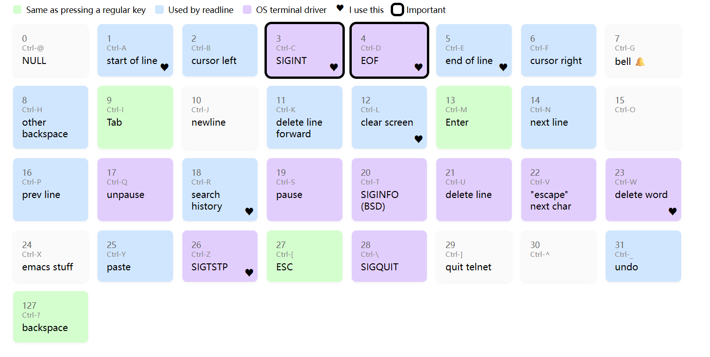

# Linux

[桌面应用|如何从 Linux 上连接到远程桌面](https://linux.cn/article-10542-1.html)

[jaywcjlove/linux-command: Linux命令大全搜索工具，内容包含Linux命令手册、详解、学习、搜集。https://git.io/linux (github.com)](https://github.com/jaywcjlove/linux-command)

[Linux命令大全(手册) – 真正好用的Linux命令在线查询网站 (linuxcool.com)](https://www.linuxcool.com/)

[鸟哥Linux命令大全(手册)_](https://man.niaoge.com/)

[Linux 命令搜索引擎 ](https://wangchujiang.com/linux-command/)（[Github](https://github.com/jaywcjlove/linux-command)）

[Linux Man Pages -- Dash Dash](https://dashdash.io/)

[explainshell.com - match command-line arguments to their help text](https://explainshell.com/)

[Bash Shell 脚本编程实践 - UinIO.com 电子技术实验室](http://www.uinio.com/Linux/Shell/)

[快乐的 Linux 命令行](https://billie66.github.io/TLCL/book/)

[An Illustrated Guide to SSH Agent Forwarding (unixwiz.net)](http://www.unixwiz.net/techtips/ssh-agent-forwarding.html)

## 软件：

[luong-komorebi/Awesome-Linux-Software: A list of awesome applications, software, tools and other materials for Linux distros. (github.com)](https://github.com/luong-komorebi/Awesome-Linux-Software)

## 资料

[Linux内核之旅 (kerneltravel.net)](https://www.kerneltravel.net/)

[Linux From Scratch](https://www.linuxfromscratch.org/lfs/view/12.0/)

[文件系统学习笔记 | Sharlayan (forsworns.github.io)](https://forsworns.github.io/zh/blogs/20210412/)

[一文搞懂 Linux 内核链表（深度分析）](https://cloud.tencent.com/developer/article/1805773)

## 安全

[为SSH登录设置电子邮件提醒](https://blog.csdn.net/linux_hua130/article/details/121943699)

[iostat工具-常用性能监测工具-磁盘IO子系统性能调优](https://www.hikunpeng.com/document/detail/zh/kunpenggrf/tuningtip/kunpengtuning_12_0035.html)

[The Reluctant Sysadmin's Guide to Securing a Linux Server (pboyd.io)](https://pboyd.io/posts/securing-a-linux-vm/)

[ASCII control characters](https://jvns.ca/ascii)