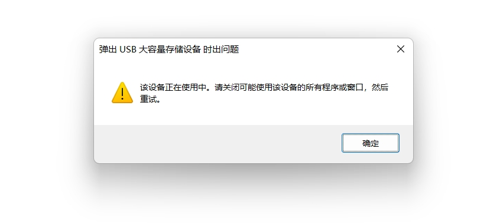

## 移动硬盘



```shell
进程 ID 为 4 的应用程序 System 已停止删除或弹出设备 USB\VID
```

解决办法[🔗](https://blog.csdn.net/m0_54706625/article/details/131902647)：


```shell
diskpart
list disk 找到移动硬盘的编号 X，一般是最后一个
select disk X
offline disk //disk X脱机
online disk //offline并拔出以后，下次在插入移动硬盘时，还会处于offline状态。因此需要online
```


