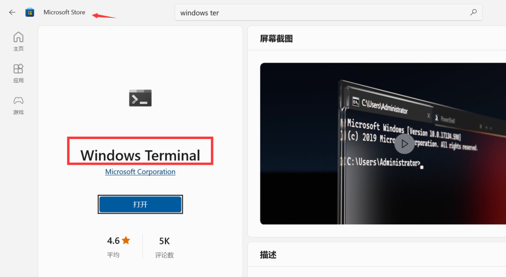

# WSL

## 安装

以管理员身份运行 `Windows PowerShell`，运行命令 `wls --install`，参考文档 [使用 WSL 在 Windows 上安装 Linux](https://learn.microsoft.com/zh-cn/windows/wsl/install)：
			


重启电脑后，正常情况会打开如下界面（如果没有弹出，点击左下角 Windows 图标,在最近添加中点击 Ubuntu）：


设置用户名、密码：


在 MicroSoft Store 中下载安装 Windows Terminal：



按照提示设置默认终端：


在 Windows Terminal 中打开 wsl 子系统 Ubuntu：


## 遇到的错误


启动 `wsl ubuntu` 出现如下错误：

```
参考的对象类型不支持尝试的操作。

[已退出进程，代码为 4294967295]
```

 
解决：

在管理员模式下运行如下命令，并重启电脑即可：

```
netsh winsock reset
```

参考：

[🔗](https://www.cnblogs.com/fanqisoft/p/13028976.html)
