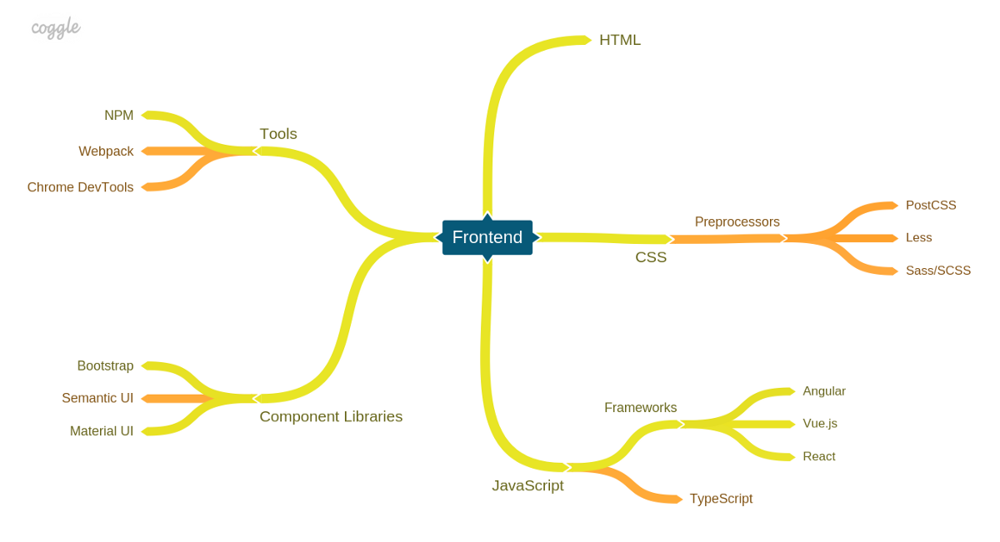
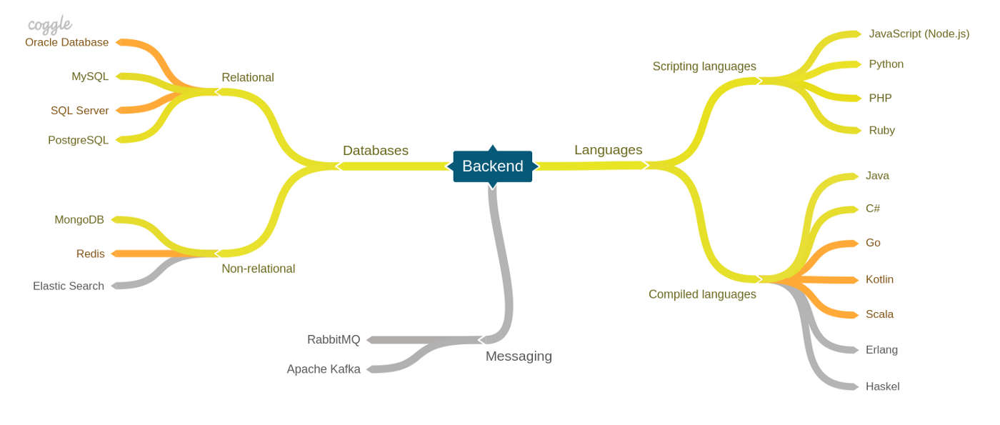

由万维网和HTML的发明者Tim Berners-Lee主持的万维网联盟（W3C）是负责带领Web标准发展的组织。

W3C发布的说明Web标准的文档称为规范（specification，缩写为spec）。这些规范对HTML、CSS等语言的参数进行了定义。也就是说，规范对语言规则进行了标准化。要了解W3C的活动，请访问www.w3.org。

由于种种原因，另一个组织，Web超文本应用技术工作组（WHATWG），在负责开发HTML5规范的大量内容。W3C将WHATWG的工作纳入了其正在开发的规范的正式版本之中。可以通过[www.whatwg.org](www.whatwg.org) 访问WHATWG。

查看这些规范：

- HTML5（W3C）：http://www.w3.org/TR/html5/
- HTML5.1（W3C）：http://www.w3.org/TR/html51/
- 开发中的HTML标准（WHATWG）：http://www.whatwg.org/specs/web-apps/current-work/multipage/

**渐进增强（progressive enhancement）** 的理念：开始用所有人都能访问的HTML内容和行为构建网站，再用CSS加入你的设计，最后用JavaScript（一种编程语言）添加额外的行为。这些组件都是分离的，但可以同时发挥作用。

[Astro - The web framework for content-driven websites](https://astro.build/)

[web.dev](https://web.developers.google.cn/?hl=zh-cn)

[GoogleChrome/web-vitals - Essential metrics for a healthy site.](https://github.com/GoogleChrome/web-vitals)

[Web Skills](https://andreasbm.github.io/web-skills/)

[Chrome for developers](https://developer.chrome.google.cn/?hl=zh-cn)

[favicon 生成](https://favicon.io/)

[OWASP Web Security Testing Guide](https://owasp.org/www-project-web-security-testing-guide/)

[50 unique mini-projects to sharpen your HTML, CSS & JavaScript skills](https://50projects50days.com/)（[Github](https://github.com/bradtraversy/50projects50days)）

[学习 Web 开发 - MDN](https://developer.mozilla.org/zh-CN/docs/Learn)

[浏览器权限请求示例](https://permission.site/)

[Motion One - A new animation library, built on the Web Animations API for the smallest filesize and the fastest performance.](https://motion.dev/)

[重新理解 Web](https://zhuanlan.zhihu.com/p/581977751)

[WebGPU 理论基础](https://webgpufundamentals.org/webgpu/lessons/zh_cn/)

[DOMPurify is a DOM-only, super-fast, uber-tolerant XSS sanitizer for HTML, MathML and SVG.](https://github.com/cure53/DOMPurify)

## 工具

[Emmet — Web 开发人员的必备工具包](https://docs.emmet.io/)

[Griddy - Learn the CSS Grid!](https://griddy.io/)

## CSS

[最佳 CSSS 框架，根据 Github Star 数据](https://www.libhunt.com/css)

基础：

[学习CSS布局](https://zh.learnlayout.com/)

[Color Formats in CSS](https://www.joshwcomeau.com/css/color-formats/)

[An Interactive Guide to Flexbox](https://www.joshwcomeau.com/css/interactive-guide-to-flexbox/)

[3D in CSS](https://garden.bradwoods.io/notes/css/3d)

浏览器样式重置：

[normalize.css](https://necolas.github.io/normalize.css/latest/normalize.css)

[现代 CSS 解决方案：Modern CSS Reset](https://segmentfault.com/a/1190000041700998)

[A Modern CSS Reset](https://www.joshwcomeau.com/css/custom-css-reset/)

小巧的 css 框架：

[picocss - Minimal CSS Framework for Semantic HTML](https://picocss.com/)

[concrete.css - A simple and to the point classless CSS stylesheet](https://concrete.style/)

[Milligram - A minimalist CSS framework](https://milligram.io/)

[https://www.starterapp.style/](https://www.starterapp.style/)

[magick.css](https://css.winterveil.net/)

[matcha.css - Drop-in semantic styling library in pure CSS.](https://matcha.mizu.sh/)

一些样式参考：

[scrollbar 样式](https://scrollbar.app/)

[CSS Inspiration -- CSS灵感](https://csscoco.com/inspiration)（[Github](https://github.com/chokcoco/CSS-Inspiration)）

[30+ Responsive CSS Hamburger Menu Example](https://frontendin.com/css-hamburger-menu/)

[The Biggest Collection of Loading Animations](https://css-loaders.com/)

[Learn and Practice Modern CSS](https://moderncss.dev/)

[如何使用 CSS flexbox 制作时间线](https://www.jonashietala.se/blog/2024/08/25/a_simple_timeline_using_css_flexbox/)

资料：

[实现 Div 居中的 10 中方法（英文）](https://www.freecodecamp.org/news/how-to-center-a-div-with-css-10-different-ways)

[如何使用CSS创建高级动画，这个函数必须掌握](https://segmentfault.com/a/1190000043564951)

[你不应该依赖CSS 100vh，这就是原因!](https://segmentfault.com/a/1190000042343159)

[谈谈 H5 移动端适配原理](https://segmentfault.com/a/1190000044155058)

[Defensive CSS 收集各种防御性的 CSS 技巧，防止客户端出现各种破坏 CSS 显示的情况](https://defensivecss.dev/)

[The Guide To Responsive Design In 2023 and Beyond](https://ishadeed.com/article/responsive-design)

[UnoCSS: The instant on-demand Atomic CSS engine](https://unocss.dev/)（[Github](https://unocss.dev/)）

[About Us Pop-Out Effect (codepen.io)](https://codepen.io/ainalem/pen/QWGNzYm)

[13 Pure CSS Mobile Devices from @marvelapp](https://marvelapp.github.io/devices.css/)

[you-dont-need/You-Dont-Need-JavaScript: CSS is powerful, you can do a lot of things without JS. (github.com)](https://github.com/you-dont-need/You-Dont-Need-JavaScript)

[现代的图片展示方式](https://kurtextrem.de/posts/modern-way-of-img)（英文，主要讲 `` 属性的一些妙用）

[GradientsGuru - 漂亮的渐变背景， 可拷贝为 css](http://gradientsguru.com/)

### Tailwindcss

[Awesome things related to Tailwind CSS](https://github.com/aniftyco/awesome-tailwindcss)

## Web 组件

[CortexJS 一个数学公式的 Web Component 组件。](https://cortexjs.io/mathlive/)

[css-doodle - 用于使用 CSS 绘制图案的 Web 组件](https://css-doodle.com/)

## Web

[Web 前端入门（Microsoft）](https://microsoft.github.io/Web-Dev-For-Beginners/)（英文）

[WebGL 理论基础](https://webglfundamentals.org/webgl/lessons/zh_cn/)（中文）

## Web3

[Web 3.0 通识课 - 飞书云文档 (feishu.cn)](https://j08v3n7cqq.feishu.cn/wiki/FWvxwnoJgiyDvck6W8pc19xKnUg)

[WTF Academy - 开发者的 Web3 开源大学](https://www.wtf.academy/)

## Web 性能优化

[了解 HTTP 协议后才能理解的预加载](https://mp.weixin.qq.com/s/2C7w4iL4DLa1QXqq-37SAw)

## 动画

[Epic Easing：Easing 动画生成调试预览工具](https://epiceasing.com/)

[如何用 CSP 防止 XSS 注入攻击 - 本文讲解怎么使用浏览器的 CSP（内容安全策略），防止网页被 XSS （跨站点脚本注入攻击）。](https://www.writesoftwarewell.com/content-security-policy/)

## 性能优化

[几个方法让图片加载更快一些](https://mp.weixin.qq.com/s/6YUuE8IJ-B9XF9On6LmLKw)

## 库

| 分类 | 名称 | Github | 文档 | 说明 |
| ---- | ---- | ---- | ---- | ---- |
| UI | Penguin UI | | [🔗](https://www.penguinui.com/docs/getting-started) | Plug-n-play UI component library for Tailwind CSS & Alpine JS |
|代码高亮| Shiki | [🔗](https://github.com/shikijs/shiki) | [🔗](https://shiki.tmrs.site/) | 美观而强大的代码高亮器 |

